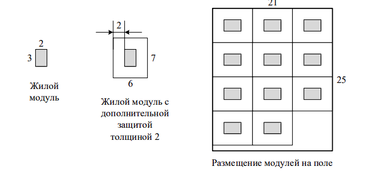

# Основы 

3.0. Двоичный поиск

Задача
--------

Напишите метод, который проверяет, входит ли в массив заданный элемент или нет.
Используйте перебор и двоичный поиск для решения этой задачи.
Сравните время выполнения обоих решений для больших массивов (например, 100000000 элементов).

Решение:
--------

    /*
        Просто перебираем, пока не найдет.
        Если ничего не найдём, вернём -1
     */
    public static int bruteForce(double[] array, double key) {
        for (int i = 0; i < array.length; i++) {
            if (array[i] == key)
                return i;
        }
        return -1;
    }

    /*
        Двоичный поиск
     */
    public static int binarySearchRecursively(double[] sortedArray, double key) {
        return binarySearchRecursively(sortedArray, key, 0, sortedArray.length);
    }

    /**
     * Вспомогательный метод для {@link #binarySearchRecursively(double[], double)}
     *
     * Будем делить отрезок пополам, но не копировать, а просто "сдвигать границы", 
     * и вызывать этот же метод рекурсивно. Для этого используем low и high
     *
     * @param sortedArray сортированный массив
     * @param key искомое значение
     * @param low от какого значения ищем
     * @param high до какого значения ищем
     * @return индекс элемента
     */
    private static int binarySearchRecursively
                    (double[] sortedArray, double key, int low, int high) {
        int middle = (low + high) / 2; // середина

        if (high < low) { // больше делить нечего
            return -1;
        }

        if (key == sortedArray[middle]) { // если нашёлся
            return middle;
        } else if (key < sortedArray[middle]) { // ищем в левой половине
            return binarySearchRecursively(
                    sortedArray, key, low, middle - 1);
        } else {
            return binarySearchRecursively( // ищем в правой половине
                    sortedArray, key, middle + 1, high);
        }
    }

    // Вспомогательный метод для тестов
    private static double[] generateRandomArray(int length) {
        double[] array = new double[length];
        for (int i = 0; i < array.length; i++) {
            array[i] = Math.random();
        }
        return array;
    }

    public static void main(String[] args) {
        double[] array = generateRandomArray(100000000);
        Arrays.sort(array); // нужно сначала отсортировать

        /*
            Строго говоря,
            измерять время выполнения так не совсем корректно,
            лучше использовать benchmarks
            см. https://habr.com/ru/post/349914/
            Но масштаб будет понятен
         */
        long time = System.currentTimeMillis(); // текущее время, unix-time
        bruteForce(array, 0.5);
        System.out.println(System.currentTimeMillis() - time);

        time = System.currentTimeMillis();
        binarySearchRecursively(array, 0.5);
        System.out.println(System.currentTimeMillis() - time);
    }

Задача
--------

Для освоения Марса требуется построить исследовательскую базу. База должна
состоять из n одинаковых модулей. Каждый модуль представляет собой жилой отсек,
который в основании имеет форму прямоугольника размером a × b метров.

Для повышения надежности модулей инженеры могут добавить вокруг каждого
модуля дополнительный защитный слой. Толщина этого слоя должна составлять целое
число метров, и все модули должны иметь одинаковую толщину защитного слоя. Модуль с
защитным слоем, толщина которой равна d метрам, будет иметь в основании форму
прямоугольника размером (a + 2d) × (b + 2d) метров.

Все модули должны быть расположены на заранее подготовленном прямоугольном
поле размером w × h метров. При этом они должны быть организованы в виде регулярной
сетки: их стороны должны быть параллельны сторонам поля, и модули должны быть
ориентированы одинаково.

Требуется написать программу, которая по заданным количеству и размеру модулей,
а также размеру поля для их размещения, определяет максимальную толщину
дополнительного защитного слоя, который можно добавить к каждому модулю.

###Формат входного файла

Входной файл содержит пять разделенных пробелами целых чисел: n, a, b, w и h
(1 ≤ n, a, b, w, h ≤ 1018). Гарантируется, что без дополнительного защитного слоя все модули
можно разместить в поселении описанным образом.

###Формат выходного файла

Выходной файл должен содержать одно целое число: максимальную возможную
толщину дополнительного защитного слоя. Если дополнительный защитный слой
установить не удастся, требуется вывести число 0.

Пример:
--------

<table>
<tr><td>данные</td><td>ответ</td></tr>
<tr><td>11 2 3 21 25</td><td>2</td></tr>
<tr><td>1 5 5 6 6</td><td>0</td></tr>
</table>

###Пояснение к примерам

В первом примере можно установить дополнительный защитный слой толщиной 2
метра и разместить модули на поле, как показано на рисунке.

Во втором примере жилой отсек имеет в основании размер 5 × 5 метров, а поле –
размер 6 × 6 метров. Добавить дополнительный защитный слой к модулю нельзя.

Решение:
--------